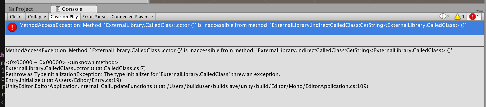

Repro of a InternalsVisibleTo bug in Unity 2017.x with 4.6 scripting runtime



`EntryPoint` creates an instance of `CalledClass` in `ExternalLibrary.csproj`,
which has a static property that triggers a call to `IndirectCalledClass` in `ExternalLibrary2.csproj`.
`IndirectCalledClass` throws with

```
MethodAccessException: Method `ExternalLibrary.CalledClass:.cctor ()' is inaccessible from method `ExternalLibrary.IndirectCalledClass:GetString<ExternalLibrary.CalledClass> ()'

<0x00000 + 0x00000> <unknown method>
ExternalLibrary.CalledClass..cctor () (at CalledClass.cs:7)
Rethrow as TypeInitializationException: The type initializer for 'ExternalLibrary.CalledClass' threw an exception.
Entry.Initialize () (at Assets/Editor/Entry.cs:19)
UnityEditor.EditorApplication.Internal_CallUpdateFunctions () (at /Users/builduser/buildslave/unity/build/Editor/Mono/EditorApplication.cs:109)
```

All libraries have `InternalsVisibleTo` set up to each other and to the `Assembly-CSharp-Editor` library in the `AssemblyInfo.cs` files.

The `Solution.sln` solution rebuilds the DLLs for the external libraries and copies them to `Assets\Editor`